<div align="center">

# 🛡️ CyberShield AI
### Intelligent Digital Safety Platform

**A fully self-contained, real-time cybersecurity analysis terminal.**  
No API keys. No external services. No network latency. Just plug in and run.

[](https://python.org)
[](https://streamlit.io)
[](https://scikit-learn.org)
[](LICENSE)

</div>

---

## 📌 What Is CyberShield AI?

CyberShield AI is a local-first security dashboard that lets users run live threat analysis across three of the most common digital attack vectors — **weak credentials**, **malicious URLs**, and **phishing emails** — from a single unified interface.

Every analysis runs entirely on-device. There are no API rate limits, no cloud subscriptions, no configuration files, and no environment variables. Clone the repo, install three packages, and the full system is operational.

The dashboard is built to behave like a real **SIEM (Security Information and Event Management)** terminal: every scan is timestamped, logged, and reflected across a live threat-level indicator that escalates automatically as threats are detected during the session.

---

## ✨ Features at a Glance

| Feature | Description |
|---|---|
| 🔐 **Password Analyzer** | Shannon entropy scoring, 5-dimension complexity breakdown, targeted fix recommendations |
| 🌐 **URL Risk Analyzer** | 13-layer lexical analysis engine — typosquatting, homoglyphs, shorteners, high-risk TLDs, open redirects |
| 📧 **Phishing Email Detector** | 4-layer hybrid heuristic + ML pipeline — covers 15 distinct attack categories |
| 📊 **Security Command Center** | Live KPI metrics, operational telemetry bar chart, full session event log |
| 🚨 **Threat Level Badge** | Animated sidebar badge that escalates: `SECURE → GUARDED → ELEVATED → CRITICAL` |
| 📋 **Export Reports** | Copy-ready plain-text assessment report generated after every scan |
| 🕒 **Scan History Terminal** | Rolling timestamped event log — behaves like a real SIEM feed |

---

## 🖥️ Dashboard Walkthrough

### Initial Dashboard
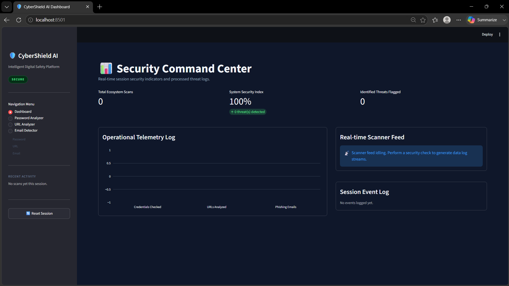
*The Security Command Center on startup — all counters at zero, scanner feed idling, threat badge showing SECURE.*

---

### 🔐 Password Analyzer

**Test 1 — Weak Password (`12345`)**

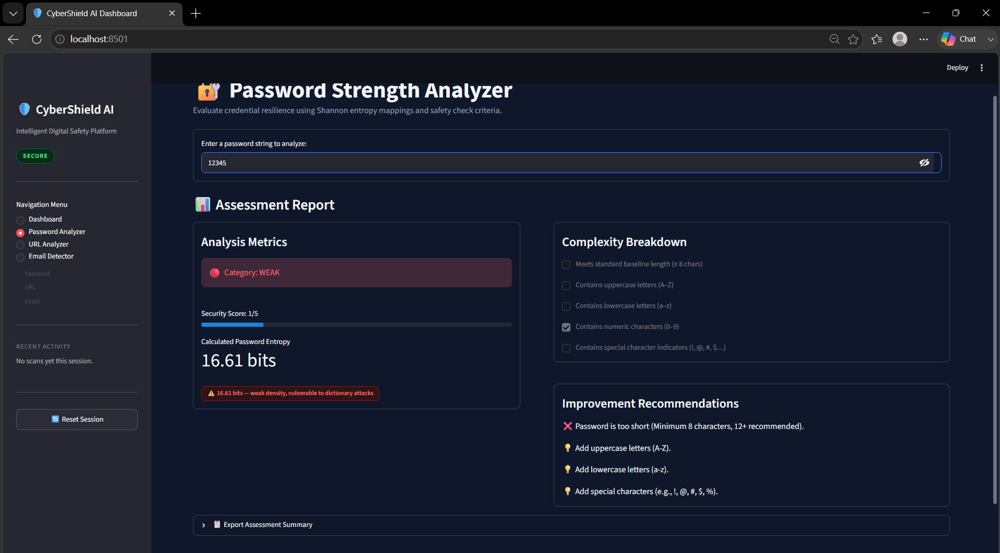
*Password entered. Entropy calculated, score computed, category determined.*

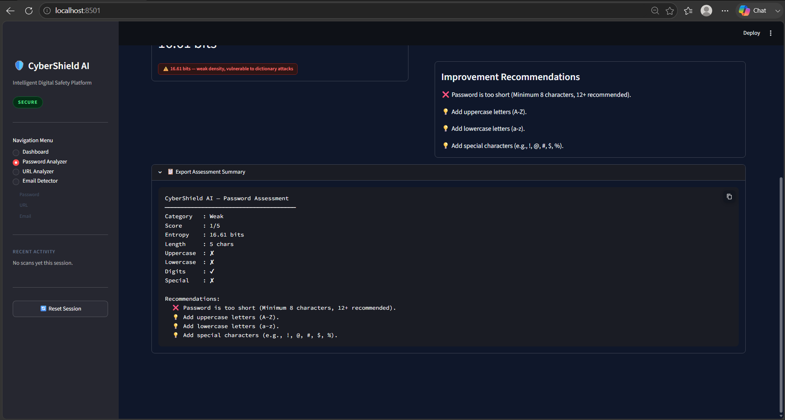
*Full assessment report: entropy in bits, 5-dimension complexity breakdown, targeted improvement recommendations, and export block.*

---

**Test 2 — Strong Password (`MySecure!Pass2025`)**

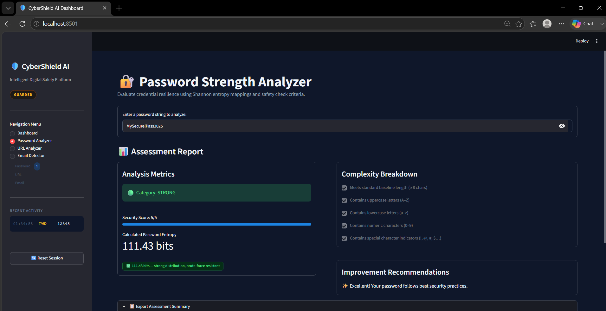
*High entropy, all five complexity criteria satisfied, category: STRONG.*

---

### 🌐 URL Risk Analyzer

**Test 1 — Typosquatted Domain (`https://g00gle.com`)**

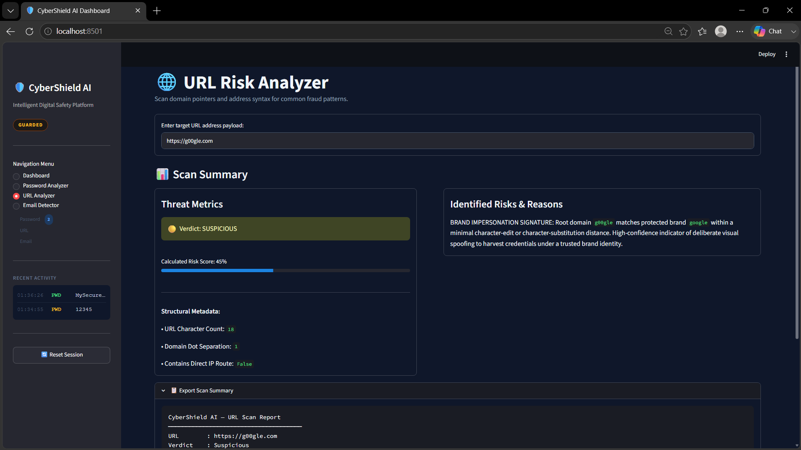
*Brand-impersonation detection fires — digit substitution (`00` for `oo`) caught by the leet-speak normalization layer.*

---

**Test 2 — Legitimate Domain (`https://www.google.com`)**

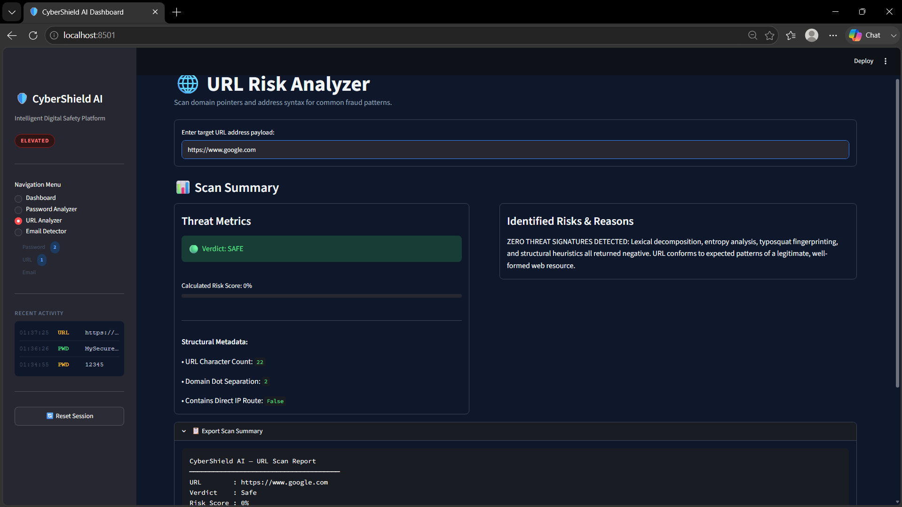
*Verified brand domain — allowlist suppression keeps the false-positive rate clean. Verdict: SAFE.*

---

**Test 3 — Legitimate with Query String (`https://www.google.com/search?q=cybersecurity`)**

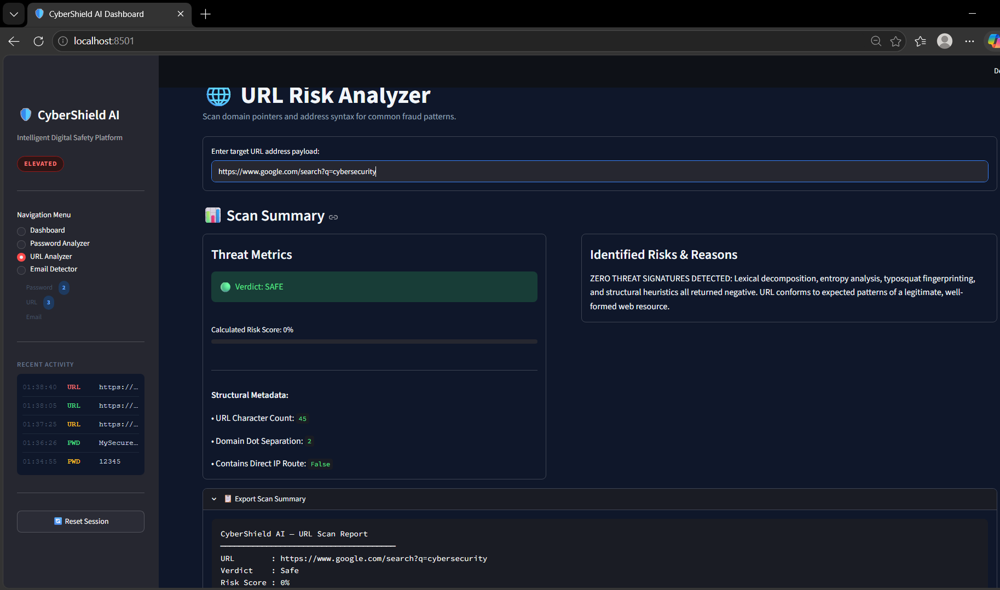
*Path and query-string keyword scanning correctly ignores a verified apex domain. Verdict: SAFE.*

---

### 📧 Phishing Email Detector

**Test 1, 2, 3 — Phishing Samples**

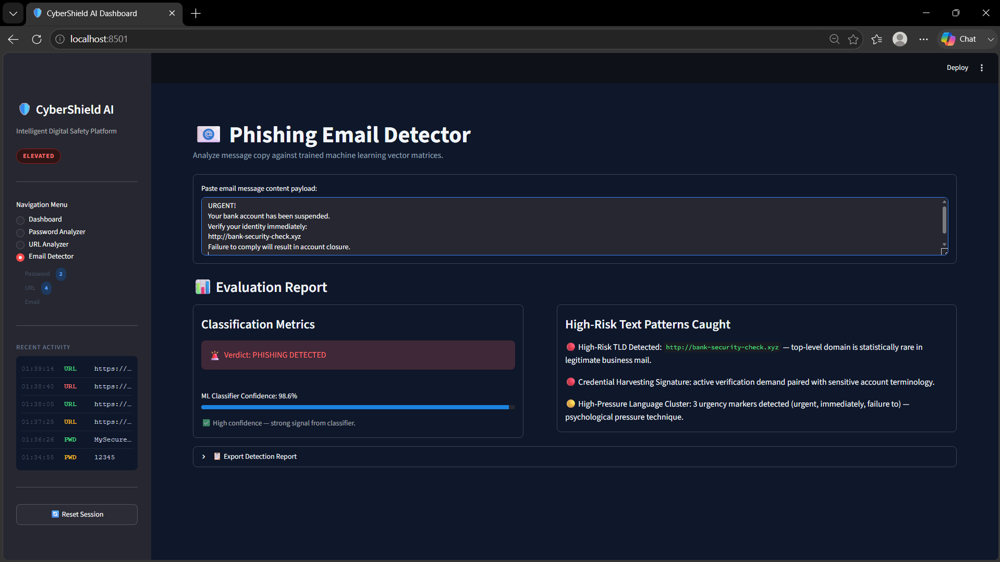

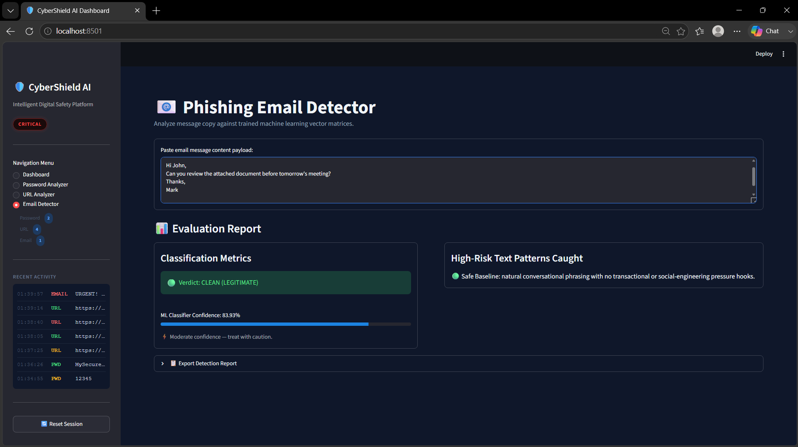

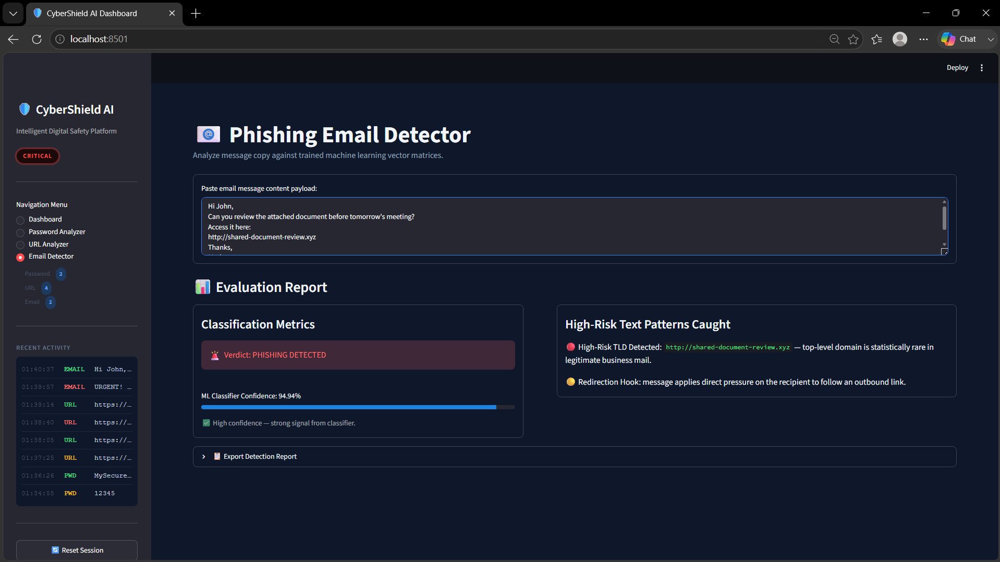

*The 4-layer pipeline in action — heuristic triggers listed with color-coded severity (`🔴` critical / `🟡` soft signal), ML classifier confidence displayed with advisory caption.*

---

### 📊 Final Dashboard State

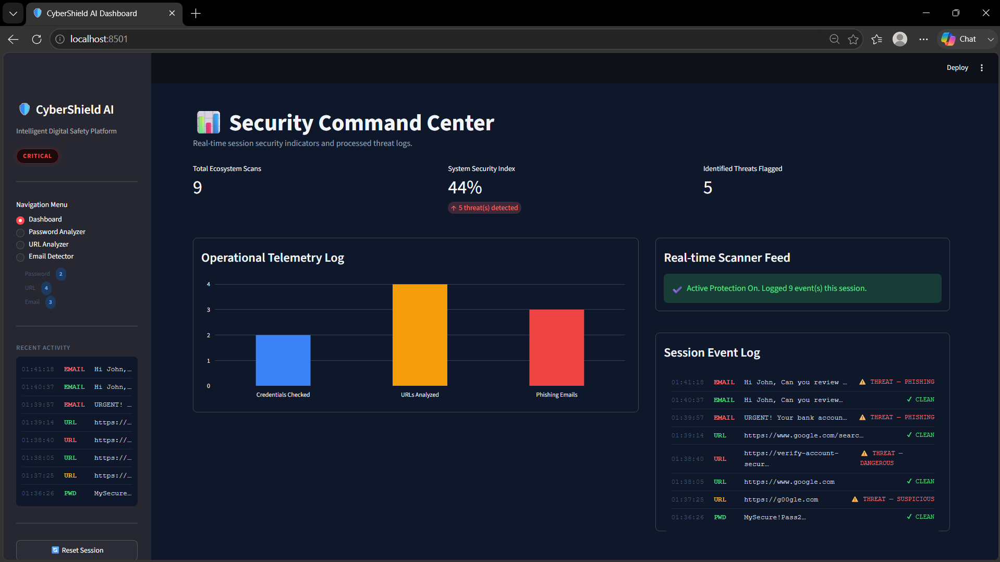
*After multiple scans — live KPI metrics updated, telemetry bar chart populated, session event log recording every timestamped scan, threat badge escalated.*

---

## 🏗️ Architecture

```
CyberShield AI/
│
├── app.py                        # Streamlit frontend orchestrator
│                                 # Session state engine, threat badge, scan history,
│                                 # export blocks, custom CSS theme
│
├── modules/
│   ├── __init__.py
│   ├── password_checker.py       # Shannon entropy + 5-dimension strength scorer
│   ├── url_analyzer.py           # 13-layer zero-dependency lexical risk engine
│   └── email_detector.py         # 4-layer heuristic + TF-IDF/LogReg hybrid classifier
│
├── models/                       # Auto-generated on first run
│   ├── phishing_model.pkl        # Serialized LogisticRegression classifier
│   └── vectorizer.pkl            # Serialized dual TfidfVectorizer pipeline
│
├── data/                         # Reserved for future corpus expansion
├── assets/                       # Dashboard screenshots
├── requirements.txt
├── .gitignore
└── README.md
```

---

## ⚙️ Tech Stack

### Frontend
- **Streamlit** — wide-layout dashboard with custom dark theme injection
- **Plotly** (`graph_objects`) — transparent-background telemetry bar chart
- **Custom HTML/CSS** — animated threat badge, monospace SIEM log terminal, entropy chip indicators, scan-count nav pills, color-coded verdict cards

### Password Analyzer — `modules/password_checker.py`
- **Shannon Entropy** formula: `E = L × log₂(R)` where `L` = length, `R` = character pool size
- Character pool assembled additively: lowercase (+26), uppercase (+26), digits (+10), special (+32)
- Dual-axis classification: score (0–5) **and** entropy (bits) must both clear thresholds independently
- Entropy thresholds: `< 40 bits` (dictionary attack risk) · `40–60 bits` (cluster cracking risk) · `60+ bits` (brute-force resistant)
- Python standard library only: `math`, `re`

### URL Risk Analyzer — `modules/url_analyzer.py`
- **13 independent detection layers**: transport security, raw IP routing, `@` redirection trick, IDN/Punycode homoglyphs, brand impersonation (Levenshtein distance + leet-speak normalization), high-risk TLD scoring (21 TLDs), URL shortener detection (13 shorteners), subdomain depth anomaly, credential-harvesting keyword scanning, open-redirect parameter detection, tracking-parameter density, Shannon entropy (DGA detection), URL length anomaly
- **Multi-vector convergence scoring**: when 3+ independent threat categories fire simultaneously, score is escalated beyond linear addition
- **Brand-aware false-positive suppression**: verified apex domain allowlist prevents flagging legitimate subdomains/paths
- Python standard library only: `re`, `math`, `urllib.parse`

### Phishing Email Detector — `modules/email_detector.py`
- **4-layer pipeline**: informational safe-pass filter → URL structural analysis → context-aware keyword heuristics → ML classifier
- **ML core**: `FeatureUnion` of word-level TF-IDF (unigrams–trigrams, 8,000 features) + character n-gram TF-IDF (`char_wb`, 3–5 grams, 4,000 features) → `LogisticRegression` (C=0.8, balanced class weight)
- **Training corpus**: 60 labeled samples across 15 attack categories (credential harvesting, BEC, CEO fraud, crypto scams, fake jobs, OTP hijack, and more)
- **Hybrid scoring**: hard critical hits guarantee Phishing verdict; soft-blend path uses `0.55 × ML_score + 0.45 × heuristic_risk`
- **RAM cache** (`_MODEL_CACHE`): model trains once, serialized to disk via `joblib`, reloaded into memory — Streamlit hot-reloads never retrain
- Dependencies: `scikit-learn`, `joblib`, `numpy`, `pandas`

---

## 🚀 Getting Started

### Prerequisites
- Python 3.11 or higher
- pip

### Installation

```bash
# 1. Clone the repository
git clone https://github.com/your-username/cybershield-ai.git
cd cybershield-ai

# 2. Create and activate a virtual environment (recommended)
python -m venv venv
venv\Scripts\activate        # Windows
source venv/bin/activate     # macOS / Linux

# 3. Install dependencies
pip install -r requirements.txt

# 4. Launch the dashboard
streamlit run app.py
```

The app opens at `http://localhost:8501`.

> **First run note:** The phishing email model trains automatically on first launch and serializes to `models/`. This takes approximately 2–3 seconds. Every subsequent run loads from disk — startup is instant.

---

## 📦 Requirements

```
streamlit
plotly
scikit-learn
joblib
numpy
pandas
```

---

## 🎯 Design Principles

**Zero external calls.** Every analysis runs locally. No API rate limits, no network latency, no key management, no service outages.

**Honest telemetry.** The System Security Index is a real ratio (`threats / total_scans`), not a clamped placeholder. Every number on the dashboard reflects actual session activity.

**Layered detection over single signals.** All three analyzers use multi-signal convergence logic. A single keyword, a single URL pattern, or a single character class never determines the verdict alone — it is always the combination of independent signals that matters.

**Instant cold start.** The ML model initializes once and caches in RAM. No external service to wake up, no cold-start penalty on second use.

**Plug-and-play.** Three `pip install` packages, one command. No database, no config files, no environment variables.


---

<div align="center">

*CyberShield AI — because security tooling shouldn't require a cloud subscription to work.*

</div>